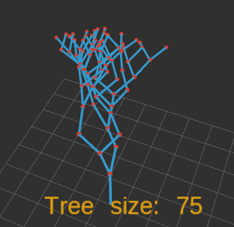
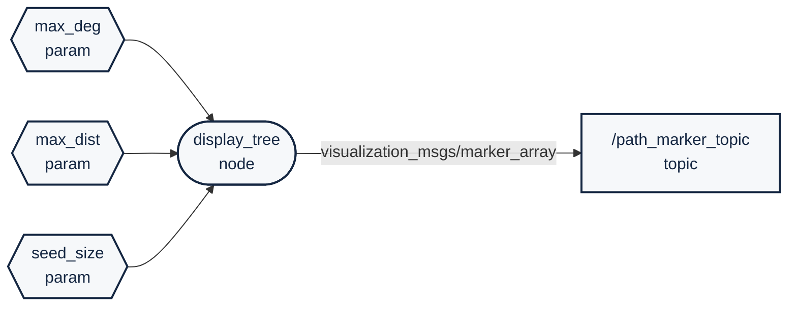

# `simple_random_trees` package
ROS 2 C++ package.  [](https://docs.ros.org/en/humble/)

## Description

**ENG**: A simple path plannig [random tree algorithm variant](https://en.wikipedia.org/wiki/Rapidly_exploring_random_tree). Implemented with a focus on visualization, rather than being a comprehensive random tree planning system.

**HUN**: Egy egyszerű útvonaltervezésre használható [véletlenszerű fa algoritmus](https://en.wikipedia.org/wiki/Rapidly_exploring_random_tree). Ez a megvalósítása a vizualizációra összpontosít, nem pedig egy átfogó véletlenszerű fa-alapú útvonal tervező rendszer.

<p align="center"></p>


## Packages and build

It is assumed that the workspace is `~/ros2_ws/`.

### Clone the packages
``` r
cd ~/ros2_ws/src
```
``` r
git clone https://github.com/horverno/simple_random_trees
```

### Build ROS 2 packages
``` r
cd ~/ros2_ws
```
``` r
colcon build --packages-select simple_random_trees --symlink-install
```

### Run ROS 2 packages
<details>
<summary> Don't forget to source before ROS commands.</summary>

``` bash
source ~/ros2_ws/install/setup.bash
```
</details>

``` r
ros2 launch simple_random_trees launch_example1.launch.py
```
``` r
ros2 run simple_random_trees display_tree_node
```

## Diagram

Made with [Mermaid diagram](https://mermaid.js.org/intro/):

